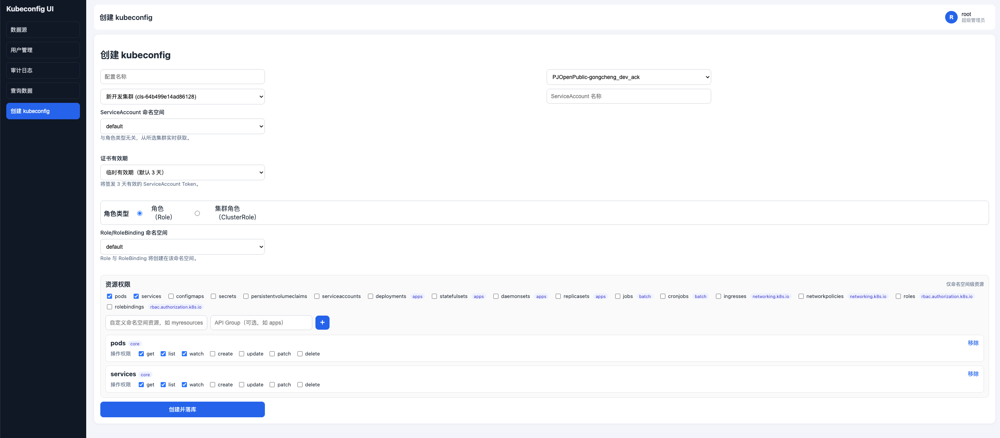

# kubeconfig-ui

可视化管理工具：在目标 Kubernetes 集群中创建受控权限的 ServiceAccount / RBAC，生成并可下载 `kubeconfig`，配置记录持久化到 MySQL。

技术栈：

- 后端：Go + Gin + GORM
- 前端：React + Vite（构建后由后端托管）
- 数据库：MySQL 8+

## 主要操作界面



## 超级管理员（首次启动）

服务首次启动且数据库中不存在 `root` 用户时，会自动创建超级管理员：

| 项 | 默认值 |
| --- | --- |
| 用户名 | `root` |
| 初始密码 | `Root@123456` |

对应配置项见 `config.example.yaml` 中的 `auth.root_initial_*`。  
**仅首次创建生效**；若库中已存在 `root`，修改配置不会覆盖已有密码。上线后请尽快修改初始密码。

## 快速开始

### 1. 准备配置

```bash
cp config.example.yaml config.yaml
# 按环境修改 database / auth / smtp 等配置
```

默认读取 `config.yaml`，也可通过环境变量指定：

```bash
export CONFIG_FILE=/path/to/config.yaml
```

### 2. 初始化 MySQL（可选）

应用启动时会自动 `CREATE DATABASE IF NOT EXISTS` 并执行 GORM AutoMigrate。  
若希望新环境预先导入**仅表结构（不含任何业务/数据源数据）**：

```bash
# MySQL 8+
mysql -h <host> -u <user> -p < deploy/sql/schema.sql

# MySQL 5.7
mysql -h <host> -u <user> -p < deploy/sql/schema-mysql57.sql
```

表结构文件：

- MySQL 8+：[`deploy/sql/schema.sql`](deploy/sql/schema.sql)
- MySQL 5.7：[`deploy/sql/schema-mysql57.sql`](deploy/sql/schema-mysql57.sql)

包含表：

- `users`
- `reset_tokens`
- `password_reset_request_logs`
- `audit_logs`
- `aliyun_accounts`
- `k8s_clusters`
- `kubeconfig_records`

### 3. 本地运行（开发）

```bash
# 后端
go mod tidy
go run ./cmd/server

# 前端（另开终端，开发热更新）
cd frontend
npm install
npm run dev
```

### 4. 本地生产模式（前端由后端托管）

```bash
cd frontend && npm install && npm run build && cd ..
go run ./cmd/server
```

浏览器访问：`http://127.0.0.1:8080`

## 构建 Docker 镜像

项目根目录提供多阶段构建 [`Dockerfile`](Dockerfile)（`deploy/Dockerfile` 内容一致）：

```bash
# 在仓库根目录执行
docker build -t kubeconfig-ui:latest .

# 或显式指定
docker build -f Dockerfile -t your-registry/kubeconfig-ui:v1.0.0 .
docker push your-registry/kubeconfig-ui:v1.0.0
```

运行示例：

```bash
docker run --rm -p 8080:8080 \
  -e CONFIG_FILE=/app/config.yaml \
  -v "$PWD/config.yaml:/app/config.yaml:ro" \
  kubeconfig-ui:latest
```

镜像内默认配置来自 `config.example.yaml`，生产请挂载真实 `config.yaml`，并保证能访问外部 MySQL。

## Kubernetes 部署

清单目录：`deploy/yamls/`

- `configmap.yaml`：应用配置
- `secret.yaml`：数据库密码等
- `deployment.yaml` / `service.yaml`

步骤详见 [`deploy/README.md`](deploy/README.md)。

```bash
docker build -t your-registry/kubeconfig-ui:latest .
docker push your-registry/kubeconfig-ui:latest
kubectl apply -f deploy/yamls/
```

## 配置说明（节选）

```yaml
server:
  port: 8080

database:
  host: 127.0.0.1
  port: 3306
  user: root
  password: "change_me"
  name: kubeconfig_ui
  charset: utf8mb4

auth:
  jwt_secret: "kubeconfig-ui-secret"
  token_expiry: "24h"
  root_initial_name: "root"
  root_initial_phone: "13000000000"
  root_initial_email: "root@example.com"
  root_initial_password: "Root@123456"
  # 忘记密码邮件（可选）
  smtp_host: ""
  smtp_port: 465
  smtp_user: ""
  smtp_pass: ""
  smtp_from: ""
```

`database.password` 为空时，会从环境变量 `DB_PASSWORD` 读取（便于 K8s Secret 注入）。

## 核心能力

- 用户体系：`root` / `admin` / `operator` / `watcher`，含注册、验证码、忘记密码
- 数据源：业务组（账号）与集群录入（API Server、CA、管理用 kubeconfig）
- 创建 kubeconfig：选择命名空间、Role/ClusterRole、资源权限；证书有效期（临时 3 天 / 指定天数 / 对齐 CA）
- 查询与下载：历史记录、剩余天数、RBAC YAML 查看、kubeconfig 下载
- 审计日志：登录、创建、下载等操作留痕

## 项目结构

```text
.
├── Dockerfile                 # 镜像多阶段构建
├── config.example.yaml        # 配置示例
├── imgs/                      # README 截图等静态资源
├── cmd/server/                # 服务入口
├── internal/                  # 业务代码
├── frontend/                  # React 前端
├── deploy/
│   ├── Dockerfile             # 与根目录 Dockerfile 一致
│   ├── sql/schema.sql         # MySQL 8+ 表结构（无数据）
│   ├── sql/schema-mysql57.sql # MySQL 5.7 表结构（无数据）
│   ├── yamls/                 # K8s 部署清单
│   └── README.md
└── README.md
```

## 常见问题

- **Q: 导入 schema.sql 后还需要 AutoMigrate 吗？**  
  A: 可以并存。预导入用于新环境建库建表；应用启动仍会做增量迁移（如新增列）。

- **Q: 初始密码登录失败？**  
  A: 确认库中是否已有 `root` 用户且密码曾被改过；或检查 `auth.root_initial_password` 是否与文档一致。

- **Q: 镜像内前端 404？**  
  A: 确认镜像构建包含 `frontend/dist`，且进程工作目录可访问 `/app/frontend/dist`。
